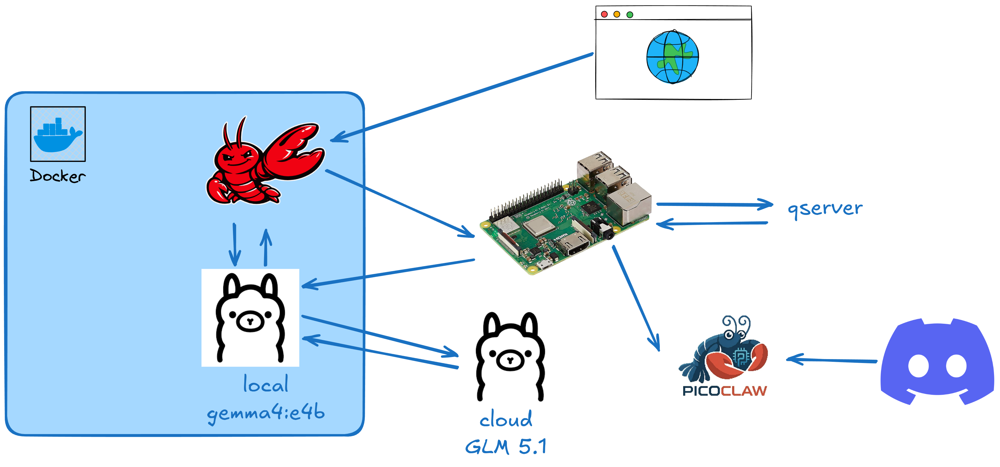

# OPENCLAW Setup

Since Openclaw has become one of those buzzy words we hear everywhere, I decided to test it myself.

My goal with this one, is similar to what I did with my [previous attempt using zeroclaw](https://github.com/Dpbm/qiskit-personal-assistant). But this time, I had a [QServer](https://github.com/Dpbm/qserver) setup running on a raspberrypi. The chief goal was to my an agent able to create quantum circuits in `qasm` format, run them on my server and retrieve the result.

> Spoiler: I did it!

I tested many different models and by the end I used both `glm-5.1` via `Ollama Cloud` and `Gemma4:e4b` locally on my GPU.

Also, since I had connection to a raspberrypi, I tried `picoclaw` in it as well, just for small stuff, connecting it via `discord`.

The final setup looked like this:



I also created many skills for that which can be seem in: [claw/workspace/skills/](./claw/workspace/skills).

## How to run

This project was not meant to be used by anyone else than me, but it's possible for you to run if you have a setup similar to mine.

My setup consists of:
* A kinda old pc with a `Nvidia GTX 1060 6Gb`.
* An ollama account.
* A raspberrypi, at least 3b+. In general can be exchanged by a VPS or an AWS instance as well. 
  * `Ubuntu Server` Installed.
* Ansible installed on the host machine.
* Docker installed on the host machine (docker compose as well).
* SSH access to the server.

For the raspberrypi setup, there're 2 `ansible` playbooks that you can use. 

> Remember to set you raspberrypi IP on the `inventory.ini` file and set it on the compose file as well in the `SERVER_URL` variable

For picoclaw you need to create a `config-picoclaw.json` file locally for setting up you agent. The main parts are, the channels which depends on what you gonna do, check my version and update as you wish.

After that you could run:

```bash
ansible-playbook -i inventory.ini config-pi.yml --ask-become-pass
ansible-playbook -i inventory.ini config-picoclaw.yml --ask-become-pass
```

Then, you must setup local directories for you claw setup. For that run:

```bash
source ./steps.sh
create_folder "$LOCAL_FOLDER"
create_folder "$LOCAL_SHARED_FOLDER"
create_folder "$LOCAL_BINS"

# install GRPCURL
curl -LO https://github.com/fullstorydev/grpcurl/releases/download/v1.9.3/grpcurl_1.9.3_linux_x86_64.tar.gz && \ 
  tar -xvf grpcurl_1.9.3_linux_x86_64.tar.gz && \
  rm -rf LICENSE grpcurl_1.9.3_linux_x86_64.tar.gz && \
  mv grpcurl ./bins
```

Doing that, we can start our servers:
```bash
export OPENCLAW_TOKEN=access_token
docker compose up -d

# download models
docker exec -it ollama ollama pull glm-5.1:cloud
docker exec -it ollama ollama pull gemma4:e4b

# to setup the cloud model run it and allow the device via URL
docker exec -it ollama ollama run glm-5.1:cloud 

# setup openclaw
docker exec -it openclaw openclaw onboard
# remember to use secretRef and token via Env Variable (set the name to OPENCLAW_TOKEN)
# use OLLAMA local+cloud pointing to `http://ollama:11434
# use Lan mode 0.0.0.0

docker compose down
docker compose up -d
```

Now you can access your server at: `localhost:18789`.
